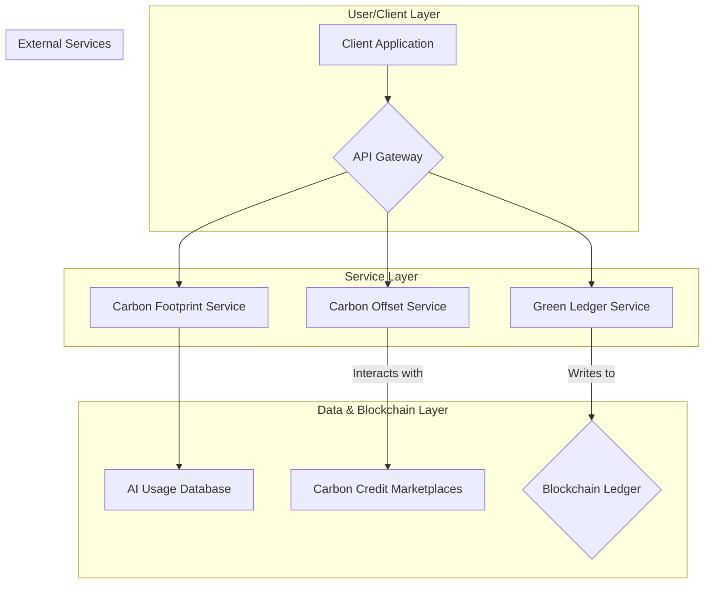

# GPTX Green AI Ledger - System Architecture

This document outlines the technical architecture for the GPTX Green AI Ledger. The design is centered around a service-oriented architecture that separates concerns between carbon footprint calculation, blockchain interaction, and user-facing services.

This project adheres to high-quality code standards, as detailed in the [CONTRIBUTING.md](CONTRIBUTING.md) file.

## Architecture Diagram

## Component Descriptions

### 1. User/Client Layer
*   **Client Application:** Any application (e.g., a web app, a CI/CD pipeline, a script) that interacts with the GPTX API.

### 2. Service Layer
*   **API Gateway:** The single entry point for all API requests. It routes requests to the appropriate backend service.
*   **Carbon Footprint Service:** Responsible for estimating the carbon footprint of AI workloads based on input parameters (e.g., model, hardware, runtime).
*   **Carbon Offset Service:** Manages the interaction with external carbon credit marketplaces, allowing users to purchase and retire carbon offsets.
*   **Green Ledger Service:** Responsible for recording carbon footprint data and offset transactions on the blockchain.

### 3. Data & Blockchain Layer
*   **AI Usage Database:** A database to store data about AI workloads for footprint calculation.
*   **Carbon Credit Marketplaces:** External platforms that provide carbon credits for purchase.
*   **Blockchain Ledger:** An immutable, public ledger (e.g., on Ethereum or a Layer 2) that stores a permanent record of all carbon offsets.
