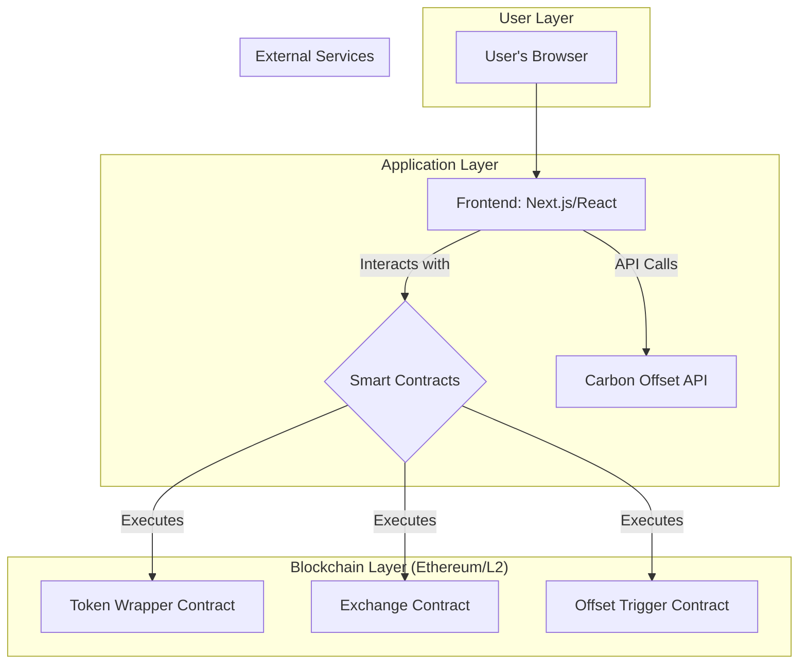

# GPTX System Architecture

This document outlines the proposed technical architecture for the GPTX platform. The design is based on a decentralized, three-layer model that separates user interaction, application logic, and blockchain execution.

## Architecture Diagram

## Component Descriptions

### 1. User Layer
*   **User's Browser:** The entry point for all user interactions. Users will connect to the frontend application using a standard web browser with a wallet extension like MetaMask.

### 2. Application Layer
*   **Frontend (Next.js/React):** A modern, responsive web application that provides the user interface. It will handle wallet connections, display token information, and facilitate interactions with the smart contracts.
*   **Carbon Offset API:** An external API service (e.g., a public API from a carbon credit provider) that the frontend will call to fetch offset data and potentially initiate offset purchases.

### 3. Blockchain Layer (Ethereum/L2)
This layer will be built on an Ethereum Virtual Machine (EVM) compatible blockchain, likely a Layer 2 solution (e.g., Arbitrum, Optimism) to ensure low transaction costs and high throughput.

*   **Smart Contracts (Solidity):** The core logic of the platform resides in a set of smart contracts.
    *   **Token Wrapper Contract:** Manages the creation (wrapping) and redemption (unwrapping) of GPTX tokens, which represent underlying AI service credits.
    *   **Exchange Contract:** A decentralized exchange (DEX) contract that allows users to trade their wrapped GPTX tokens.
    *   **Offset Trigger Contract:** This contract is triggered when a token is "retired." It will interact with a carbon offset provider (either via an oracle or a direct integration) to purchase and record a carbon offset on-chain.