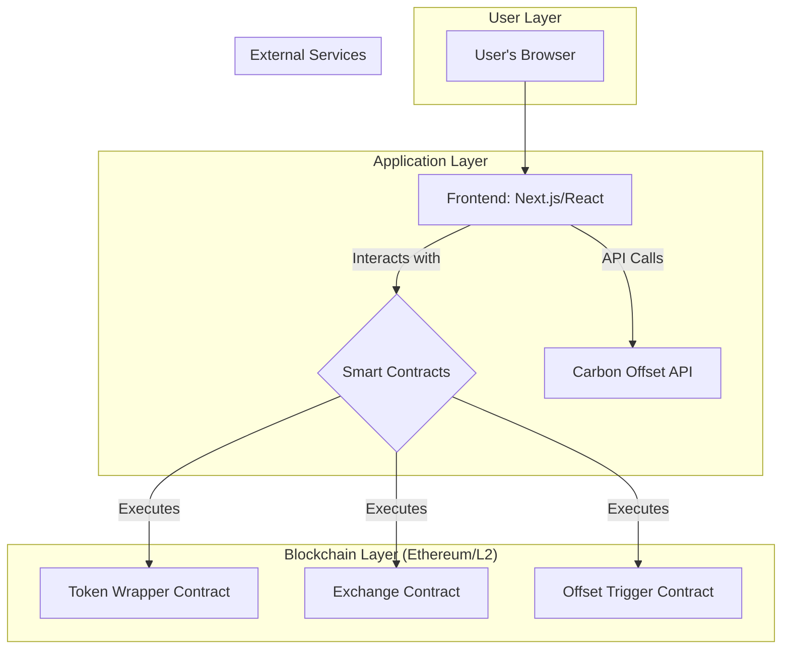

# GPTX Project Plan

This document provides a comprehensive overview of the GPTX project, including its purpose, system architecture, and development roadmap.

## 1. Project Overview

**Purpose:** GPTX is a decentralized exchange for tokenized AI service credits, featuring an integrated carbon offset mechanism. This repository contains the project's public-facing landing page, initial use case analysis, and technical proof-of-concept documentation.

The primary goal is to create a platform that:
*   Unlocks the value of unused AI tokens.
*   Offsets the carbon footprint of idle compute resources.
*   Provides decentralized access and community governance.

## 2. System Architecture

The proposed technical architecture is based on a decentralized, three-layer model.

### Architecture Diagram

### Components
*   **User Layer:** A standard web browser with a wallet extension (e.g., MetaMask).
*   **Application Layer:** A Next.js/React frontend for user interaction and an external API for carbon offset data.
*   **Blockchain Layer (Ethereum/L2):** Solidity smart contracts (Token Wrapper, Exchange, Offset Trigger) deployed on a low-cost, high-throughput Layer 2 network.

## 3. Development Roadmap

The project will be developed in phases, with the following high-level milestones:

### Q3 2025: Proof-of-Concept (POC)
*   **Goal:** Develop and deploy a functional POC on an Ethereum testnet.
*   **Deliverables:** Core smart contracts, minimal frontend, and a public demo.

### Q4 2025: Alpha & Security Audit
*   **Goal:** Prepare for a limited public release.
*   **Deliverables:** Full security audit, a limited Alpha program, and the initial DAO framework.

### Q1 2026: Public Beta Launch
*   **Goal:** Open the platform to the public.
*   **Deliverables:** Public beta launch, initial DAO governance, and the first official carbon offset partner.

### Q2 2026: Expansion & Ecosystem Growth
*   **Goal:** Expand platform capabilities.
*   **Deliverables:** Integration with new AI service providers, a developer API, and a DAO-funded grants program.